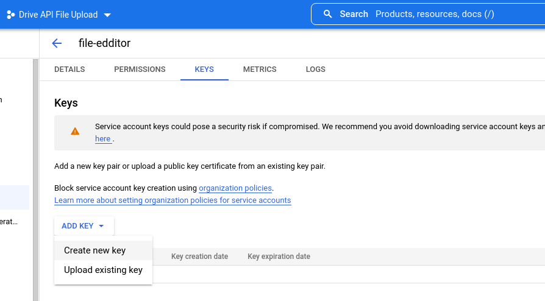

# reddit-etl

## Description
A data pipeline for extracting and visualizing basic activity in [r/ukraine](https://www.reddit.com/r/ukraine/) Reddit community.


## Project Architecture


- Data extracted with PRAW: The Python Reddit API Wrapper
- Visualized with Tableau and Google Data Studio
- Orchestrated with Airflow in Docker
- Hosted on Raspberry Pi 3B


## Project Output
- [Google Data Studio Dashboard](https://datastudio.google.com/reporting/c2344f36-2381-41b5-804e-395347154138)


- Tableau Dashboard


## Project setup

### Setup Airflow on Docker
(details [here](https://airflow.apache.org/docs/apache-airflow/stable/start/docker.html))

* Download ```docker-compose.yaml``` 
        ```bash
        curl -LfO 'https://airflow.apache.org/docs/apache-airflow/2.3.2/docker-compose.yaml'
        ```
* Add the required libraries to  ```docker-compose.yaml``` 
    ```yaml
    _PIP_ADDITIONAL_REQUIREMENTS: ${_PIP_ADDITIONAL_REQUIREMENTS:- praw pandas pygsheet}
    ```
     This is a development/test feature only. This should never be used in production(
build a custom image as described in [the docs](https://airflow.apache.org/docs/docker-stack/build.html)), 
but it would be enough for our project.
* In the project/airflow directory run 
    ```bash
    mkdir -p ./dags ./logs ./plugins
    ```
* Run the next command to create ```.env``` file next to ```docker-compose.yaml```:
    ```yaml
    echo -e "AIRFLOW_UID=$(id -u)" > .env
    ```
* Initialize the database to run database migrations and create the first user account
    ```bash
    docker-compose up airflow-init
    ```
    The created account has the login airflow and the password airflow
    
* Now start the Airflow
    ```bash
    docker-compose up
    ```
    The Airflow web server is available at http://localhost:8080


### Setup Reddit App
* First, you need an active Reddit account. If you don't have one, create
* Go to [reddit.com/prefs/apps](https://reddit.com/prefs/apps). If the previous link doesn't work for you, try [old.reddit.com/prefs/apps/](https://old.reddit.com/prefs/apps/)
* Select **create another app**. Make sure you select the **Script** option
* Fill in the description and optional fields. Click **create app**

* Next, you will see your client id and secret. These values will be 
needed in the next step

* Create ```pipeline.conf``` file in the ```dags/extraction``` directory with the credentials from the previous step
    ```
    [reddit]
    client_id = your_script_client_id
    client_secret = your_script_client_secret
    ```

### Google Sheets API Setup
* Go to Google Sheets and create a new sheet. Leave it empty
* Create a project if you don't already have one
* Next, create a service account from [Google API Console](https://console.cloud.google.com/apis)
* Search for Google Drive API (Sheets API) and Enable it
* Then go to Credentials and click ```+ CREATE CREDENTIALS``` > ```Service Account```


* Click on your newly created account and go to the *Keys* tab


* Click ```Add Key``` > ```Create New Key``` 


* Key type select ```JSON``` > ```CREATE```


* Save the key to the project folder
* Share the file with the value from a ```client_email``` field


### Credentials
- praw
- pandas
- pygsheets

The idea was taken from https://github.com/ABZ-Aaron/Reddit-API-Pipeline